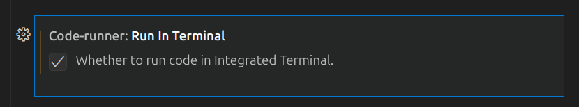
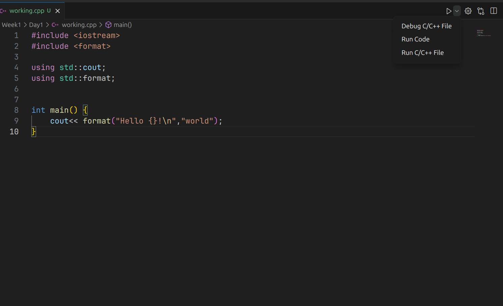
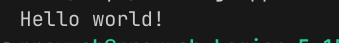

# 🐧 Setting Up Your Coding Environment on Linux!  

Hey there, Linux coders! 👋 In this guide, we’re going to set up **VS Code** and the necessary tools for this course. A little patience will go a long way, but this is the **first and most important step** to get started! Let’s do this! 💪  

---

## ✅ Requirements  

### 1️⃣ Install **VS Code** 🖥️  
If you haven’t already installed **VS Code**, no worries! Just follow these steps:  

#### 📦 Install VS Code on Debian/Ubuntu  
```sh
sudo apt update && sudo apt install code
```  
#### 📦 Install VS Code on Arch Linux  
```sh
sudo pacman -S code
```  
#### 📦 Install VS Code on Fedora  
```sh
sudo dnf install code
```  
Alternatively, you can **download VS Code manually** from:  
👉 [Download VS Code](https://code.visualstudio.com/download)  

---

### 2️⃣ Install **G++ Compiler 13+** 🛠️  
We need to make sure we have the correct version of the **G++ compiler** installed.  

#### 🔍 Check Your G++ Version  
Open your **terminal** and run:  
```sh
g++ --version
```  
If your version is **less than 13**, follow these steps:  

#### 🏗 Install G++ Compiler  

✅ **For Debian/Ubuntu**  
```sh
sudo apt update && sudo apt install g++-13
```  

✅ **For Arch Linux**  
```sh
sudo pacman -S gcc
```  

✅ **For Fedora**  
```sh
sudo dnf install gcc-c++
```  

After installation, verify with:  
```sh
g++ --version
```  

---

### 3️⃣ Install **Code Runner & Extensions** 🔌  
Once **VS Code** and the compiler are installed, let’s set up some **extensions** and get our project folder ready!  

#### 📁 Create Your Project Folder  
- Make a new folder where you’ll be following the course.  
- Open this folder in **VS Code**.  

#### 🔍 Install These Extensions  
Go to the **Extensions** tab in VS Code and install:  
✅ **Code Runner**  
✅ **C/C++ Extension Pack**  

#### ⚙️ Configure VS Code Settings  
- Inside your project folder, create a **.vscode** folder.  
- Inside `.vscode`, create a file called **settings.json**.  
- Copy and paste the following code into `settings.json`:  

  ```json
    {
    "files.associations": {
        "format": "cpp",
        "iostream": "cpp"
    },
    "code-runner.executorMap": {
        "cpp": "g++-13 -std=c++20 -o $fileNameWithoutExt $fullFileName -lstdc++ && ./$fileNameWithoutExt"
    },
    "C_Cpp.errorSquiggles": "disabled"
    }
  ```

---

### 4️⃣ Configure **Code Runner** ⚡  
Just one last step! Let’s tweak **Code Runner** settings for a smooth experience.  

1. Open **VS Code Settings** by clicking the ⚙️ icon at the bottom left.  
2. Search for **"Run in terminal"** and make sure to **tick** this option.  

📸   

---

### 5️⃣ Test Your Setup 🎯  

Let’s check if everything is working! 🚀  

1. Create a new file called **main.cpp** inside your project folder.  
2. Copy and paste this code:  

   ```cpp
   #include <iostream>
   #include <format>

   using std::cout;
   using std::format;

   int main() {
       cout << format("Hello {}!\n", "world");
   }
   ```
3. Click the **Run** ▶️ button at the top and select **Run Code**.  

📸   

If you see this output, **congrats! 🎉 Your setup is complete!**  

📸   

---

### 🎉 You’re Ready to Code!  
That’s it! Now you’re all set to start coding 🚀. If you run into any issues, **don’t worry**—just double-check the steps or ask for help! Happy coding! 😃🎯